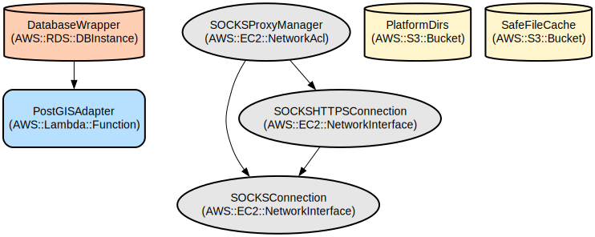

# Django Web Application Framework with Extended Functionality

A comprehensive Django web application framework that provides a robust foundation for building web applications with integrated user authentication, static file handling, and database management. This project extends Django's core functionality with additional features for user management, static content, and database operations.

The project is built on Django's powerful web framework and includes several key components:
- User authentication and authorization system with customizable user profiles
- Static file management with support for CSS, JavaScript, and media files
- Database abstraction layer supporting multiple database backends (PostgreSQL, MySQL, SQLite)
- Template system with extensive tag and filter libraries
- URL routing and request handling
- Form processing and validation
- Admin interface for managing application data

## Repository Structure
```
.
├── env/                      # Virtual environment directory containing Django and dependencies
├── manage.py                 # Django's command-line utility for administrative tasks
├── README.md                 # Project documentation
├── static/                   # Static files directory for CSS, JS, and other assets
│   ├── aboutMirea.css       # Styling for MIREA information page
│   ├── aboutProject.css     # Project information page styling
│   ├── aboutTeam.css        # Team information page styling
│   ├── addMail.css         # Email addition page styling
│   └── ...                 # Additional static files
├── store/                   # Main project configuration directory
│   ├── __init__.py
│   ├── asgi.py             # ASGI configuration for async web servers
│   ├── settings.py         # Project settings and configuration
│   ├── urls.py            # Project URL configuration
│   └── wsgi.py            # WSGI configuration for web servers
├── users/                  # User management application
│   ├── __init__.py
│   ├── admin.py           # Admin interface configuration
│   ├── apps.py            # Application configuration
│   ├── forms.py           # User-related forms
│   ├── models.py          # User data models
│   ├── templates/         # User-related templates
│   ├── tests.py          # User application tests
│   ├── urls.py           # User application URL routing
│   └── views.py          # User-related views
└── xakaton/              # Additional application module
    ├── __init__.py
    ├── admin.py
    ├── apps.py
    ├── models.py
    ├── templates/
    ├── tests.py
    ├── urls.py
    └── views.py
```

## Usage Instructions
### Prerequisites
- Python 3.8 or higher
- pip (Python package installer)
- Virtual environment tool (venv)
- Database system (PostgreSQL, MySQL, or SQLite)

### Installation
1. Clone the repository:
```bash
git clone <repository-url>
cd <project-directory>
```

2. Create and activate a virtual environment:
```bash
# Windows
python -m venv env
env\Scripts\activate

# Linux/MacOS
python3 -m venv env
source env/bin/activate
```

3. Install dependencies:
```bash
pip install -r requirements.txt
```

4. Configure the database in settings.py:
```python
DATABASES = {
    'default': {
        'ENGINE': 'django.db.backends.sqlite3',
        'NAME': BASE_DIR / 'db.sqlite3',
    }
}
```

5. Apply database migrations:
```bash
python manage.py migrate
```

6. Create a superuser:
```bash
python manage.py createsuperuser
```

### Quick Start
1. Start the development server:
```bash
python manage.py runserver
```

2. Access the application:
- Admin interface: http://localhost:8000/admin/
- Main application: http://localhost:8000/

### More Detailed Examples
1. Creating a new user:
```python
from users.models import User

user = User.objects.create_user(
    username='testuser',
    email='test@example.com',
    password='securepassword'
)
```

2. Working with static files:
```html

<link rel="stylesheet" href="">
```

### Troubleshooting
1. Database Migration Issues
- Problem: Migration errors
- Solution: Reset migrations
```bash
python manage.py migrate --fake users zero
python manage.py migrate users
```

2. Static Files Not Loading
- Check STATIC_ROOT and STATIC_URL in settings.py
- Run collectstatic:
```bash
python manage.py collectstatic
```

## Data Flow
The application follows a standard Django MVT (Model-View-Template) architecture:

```ascii
Client Request → URLs → View → Model ↔ Database
                            ↓
                        Template
                            ↓
                    Client Response
```

Key component interactions:
- URLs route incoming requests to appropriate views
- Views process requests and interact with models
- Models handle data operations and business logic
- Templates render the final HTML response
- Static files are served directly by the web server
- User authentication flows through middleware
- Database operations are abstracted through Django's ORM
- Form processing includes validation and error handling

## Infrastructure


### Database
- Uses Django's ORM for database operations
- Supports multiple database backends
- Includes migration system for schema management

### Static Files
- Served through Django's staticfiles app
- Supports file collection and compression
- Configurable storage backends

### User Management
- Custom user model with extended fields
- Authentication middleware
- Session handling
- Permission system